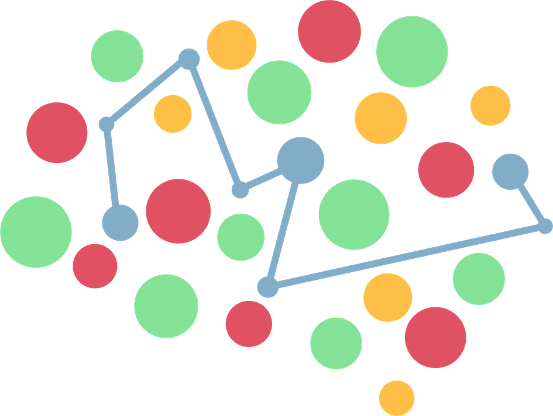

# Projeto IntegraEd

Nosso objetivo é fornecer uma plataforma online que centralize, em um único ambiente, o cadastro de incubadoras, edutechs, parceiros e especialistas com informações precisas e atualizadas sobre seus produtos e serviços. Na outra via, oferecer soluções que atendam às necessidades de estudantes, profissionais empreendedores e qualquer outra pessoa que esteja buscando por algum tipo de orientação ou conhecimento. 

## 📌 Como acessar a plataforma?
Link: [integraed.surge.sh](https://integraed.surge.sh)

## 🛠 Tecnologias Utilizadas

- Componentes em React;
- Styled-Components; 
- Fluxos de dados; 
- Renderização condicional;
- React Router;
- Design Systems;

## 👩‍💻 Pessoas autoras

### Ana Júlia Santos Lopes
### Laís Rodrigues Macedo 
### Elaine Gomes da Silva